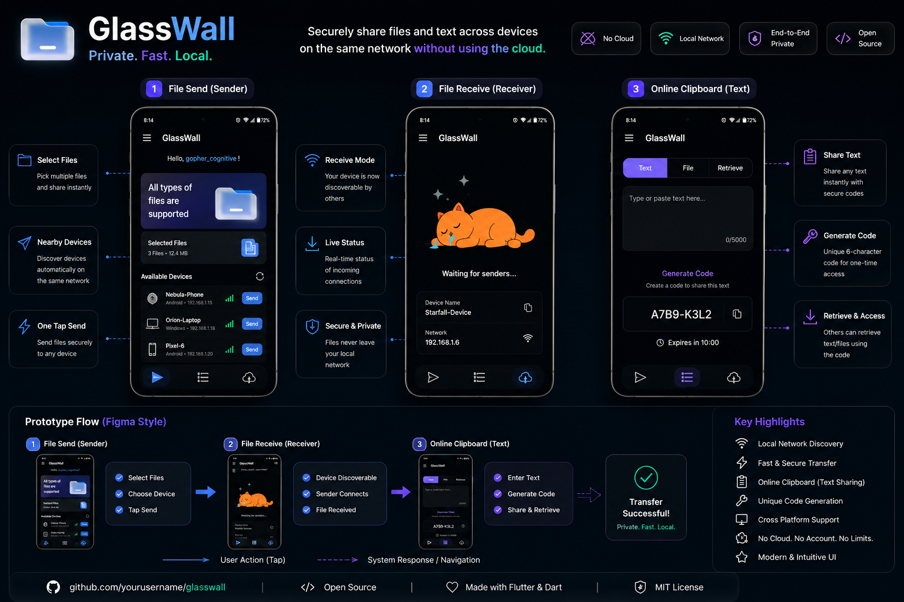
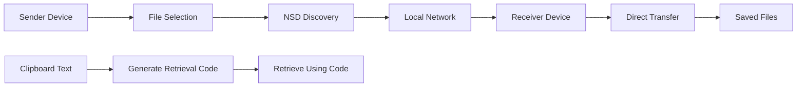
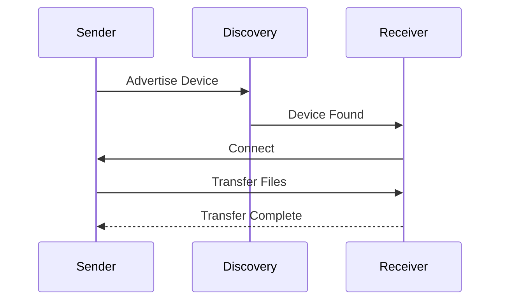

<div align="center">

# GlassWall

### Private. Fast. Local.

Modern cross-platform file and text sharing built with Flutter.

Share files and text instantly across devices on the same network without cloud storage, accounts, or internet dependency.

<br>


</div>

---

## Overview

GlassWall is a modern Flutter-based local communication platform that enables secure file sharing, device discovery, and clipboard-based text exchange across devices connected to the same network.

Unlike traditional cloud-based sharing solutions, GlassWall operates entirely within the local network, providing faster transfers, improved privacy, and a seamless user experience.

### Key Highlights

* ⚡ Fast local file transfer
* 📡 Automatic device discovery
* 📂 Multi-file sharing
* 📥 Dedicated receiver mode
* 📝 Online clipboard sharing
* 🔑 One-time retrieval code generation
* 🔒 Privacy-first architecture
* 🌙 Dark & Light themes
* 🎨 Modern UI
* 🚀 Cross-platform Flutter application
* 📱 Android Support
* 🖥️ Linux Support

---

# Prototype Showcase

<p align="center">
  
</p>

<p align="center">
  <b>GlassWall User Flow</b><br>
  File Send → Device Discovery → File Receive → Online Clipboard → Secure Retrieval
</p>

---

# Architecture



---

# Transfer Flow



---

# Tech Stack

| Layer             | Technology        |
| ----------------- | ----------------- |
| Framework         | Flutter           |
| Language          | Dart              |
| Service Discovery | NSD               |
| Local Storage     | SharedPreferences |
| File Selection    | File Picker       |
| Animations        | Lottie            |
| Networking        | TCP Socket        |
| Platform Support  | Android, Linux    |

---

# Features

## File Sending

* Select multiple files
* Discover nearby devices automatically
* Send files directly over local network
* No internet required

---

## File Receiving

* Auto-register on local network
* Become discoverable instantly
* Receive files securely
* Real-time sender detection

---

## Online Clipboard

* Share text instantly
* Generate unique retrieval codes
* Retrieve content from another device
* Temporary secure access
* No cloud dependency

---

## Device Discovery

* Network Service Discovery (NSD)
* Automatic peer detection
* Real-time device updates
* Local network communication

---

## User Experience

* Auto-generated device names
* Dark & Light themes
* Responsive layouts
* Modern navigation
* Smooth animations

---

# Project Structure

```text
lib
│
├── main.dart
├── setup.dart
├── screen1.dart        # File Sending
├── screen2.dart        # File Receiving
├── screen3.dart        # Online Clipboard
│
assets
│
├── animations
├── icons
├── images
└── lottie
│
android
linux
windows
```

---

# Application Modules

| Module           | Description                        |
| ---------------- | ---------------------------------- |
| File Send        | Select and transfer files          |
| File Receive     | Discover and receive files         |
| Online Clipboard | Share text using retrieval codes   |
| Device Discovery | Detect nearby devices              |
| Settings         | User preferences and configuration |

---

# Why GlassWall?

Most file-sharing platforms depend on:

* Cloud servers
* User accounts
* Internet connectivity
* Third-party infrastructure

GlassWall follows a local-first approach:

✅ No cloud dependency

✅ No account creation

✅ No external servers

✅ Faster transfers

✅ Better privacy

✅ Local network communication

Your data never leaves your network.

---

# Future Roadmap

## Version 1.0

* [x] Sender Mode
* [x] Receiver Mode
* [x] Device Discovery
* [x] Multi-file Selection
* [x] Online Clipboard
* [x] Retrieval Code Generation

---

## Version 2.0

* [ ] Transfer Progress Tracking
* [ ] Device Avatars
* [ ] Transfer History
* [ ] File Preview Support
* [ ] Better Animations
* [ ] Theme Customization

---

## Version 3.0

* [ ] QR Pairing
* [ ] End-to-End Encryption
* [ ] Windows Optimization
* [ ] macOS Support
* [ ] iOS Support
* [ ] Web Dashboard

---

# Installation

```bash
git clone https://github.com/yourusername/glasswall.git

cd glasswall

flutter pub get

flutter run
```

---

# Open Source

Contributions, feature requests, and feedback are welcome.

If you find GlassWall useful, consider starring the repository.

---

# License

This project is licensed under the MIT License.

---

<div align="center">

### Local-First Device Communication

Secure file and text sharing across devices without relying on cloud infrastructure.

</div>
